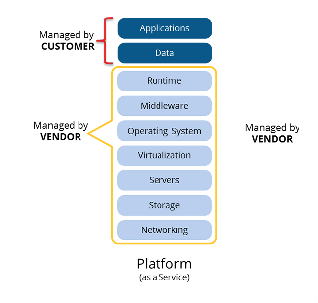
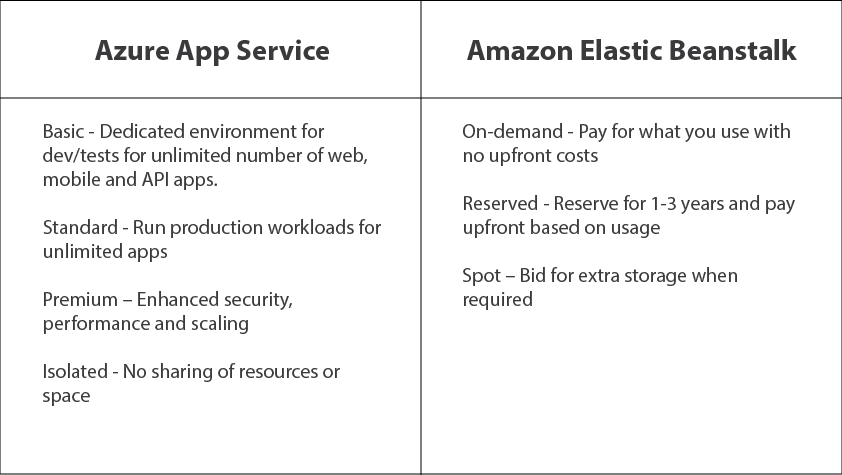

# What is Azure App Service?
Azure App Service is a service for hosting web applications, REST APIs, and mobile back ends. You can develop in your favorite language, be it .NET, .NET Core, Java, Ruby, Node.js, PHP, or Python. Applications run and scale with ease.

### App Service vs Virtual Machine

Azure App Service is the best choice for most web apps. Deployment and management are integrated into the platform, sites can scale quickly to handle high traffic loads, and the built-in load balancing and traffic manager provide high availability.

Azure Virtual Machines is Infrastructure-as-a-Service (IaaS), while App Service is Platform-as-a-Service (Paas). If you are considering Azure Virtual Machines, make sure you take into account the ongoing maintenance effort required to patch, update, and manage your VM environment.

As a PaaS platform, Azure App Service enables you go through the different stages of app development smoothly, thereby offering the perfect environment, minus the worries of building and maintaining the underlying infrastructure that’s required for the development process.

# Benefits of Using PaaS for Web App Development and Hosting
- Quicker deployment

  The time taken for app deployment is less, because you can eliminate the many steps involved in setting the basics of your applications. After deployment, you can integrate, adapt or scale your app anytime.

- Cost effectiveness

  One of the biggest advantages of PaaS is that you can use advanced development software, business intelligence and analytics tools without actually purchasing them

- Simplifies operations

  PaaS offerings can cut down the complexity of their operations because the provider manages everything - OS, virtualization, servers, storage, networking, and the PaaS software

- Incredible insight into app usage

  The platform lets you determine user behavior and app utilization by analyzing the usage patterns and interactions. This way they would be able to focus on the features that users are most interested in, and improve the ones that were not popular.

# Azure App Service vs AWS Elastic Beanstalk

### Features
- https://hackernoon.com/azure-app-service-vs-aws-elastic-beanstalk-a-comparison-of-paas-providers-2a73e37d6fa7
- https://stackshare.io/stackups/aws-elastic-beanstalk-vs-azure-websites
- https://docs.microsoft.com/en-us/azure/architecture/aws-professional/services

### Architecture

- AWS Elastic Beanstalk: When you deploy your application, Elastic Beanstalk provisions one or more AWS resources, such as Amazon EC2 instances. The software stack that runs on your Amazon EC2 instances depends on the configuration. For example, Elastic Beanstalk supports two configurations for the Java SE platform: one running Java 7, and the other running Java 8. Each runs a software stack tailored to hosting a Java application.

- Azure App Service: App Service is fully managed, which means no administrative tasks are required to manage underlining compute infrastructures (servers) on which your applications run. You don’t need to worry about the underlining server maintenance as the platform patches the OS and frameworks for you. Your application runs on virtualized servers, but you should only care for setting the maximum number of server instances on which you want your application to run. Azure App Service will automatically handle assignment of applications to compute resources. The service will also automatically handle constraining the maximum number of running application instances based on the number of Workers setting for each individual application. As a result, increasing the numbers of Workers in the App Service Plan will not result in 50 app instances spinning up on each new available virtual machine.

### Languages Supported
- Azure App Service: The platform supports application development in PHP, .NET, .NET Core, Node.js, Python, Java and Ruby. Developers can use software developer kits (SDKs) and Visual Studio to create and deploy applications.

- AWS Elastic Beanstalk: Allows users to create, deploy and scale web applications and services in a number of languages including Java, .NET, PHP, Node.js, Python, Ruby, Go and Docker on common servers, like Apache, Passenger, Nginx and IIS.

### Pricing

# Further Readings
- [Azure App Service, Virtual Machines, Service Fabric, and Cloud Services comparison](https://docs.microsoft.com/en-us/azure/app-service/choose-web-site-cloud-service-vm)
- [Azure-App-Service-in-depth](https://channel9.msdn.com/Blogs/MostafaElzoghbi/Azure-App-Service-in-depth)
