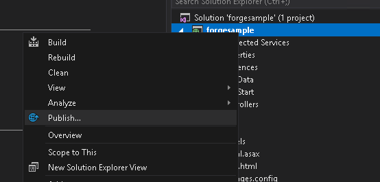
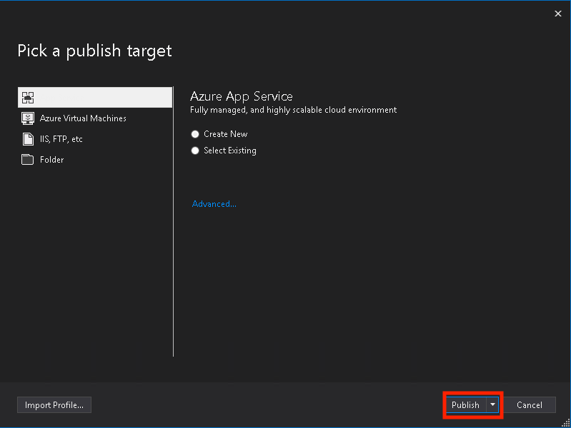
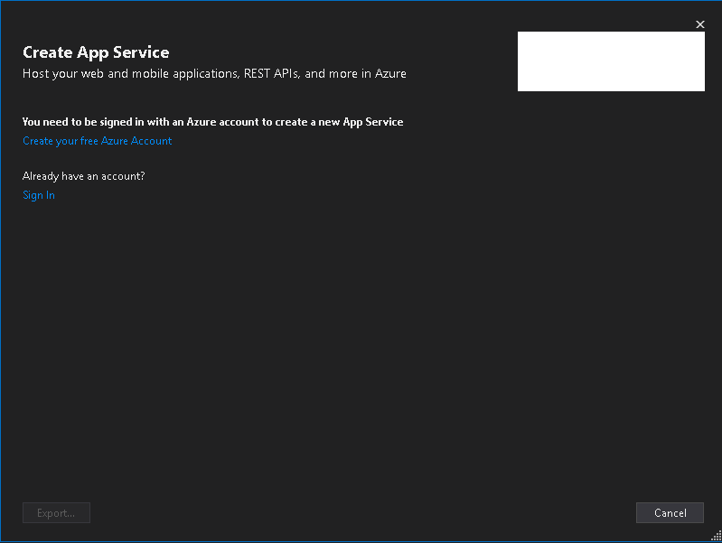
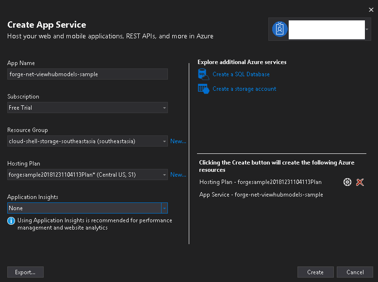
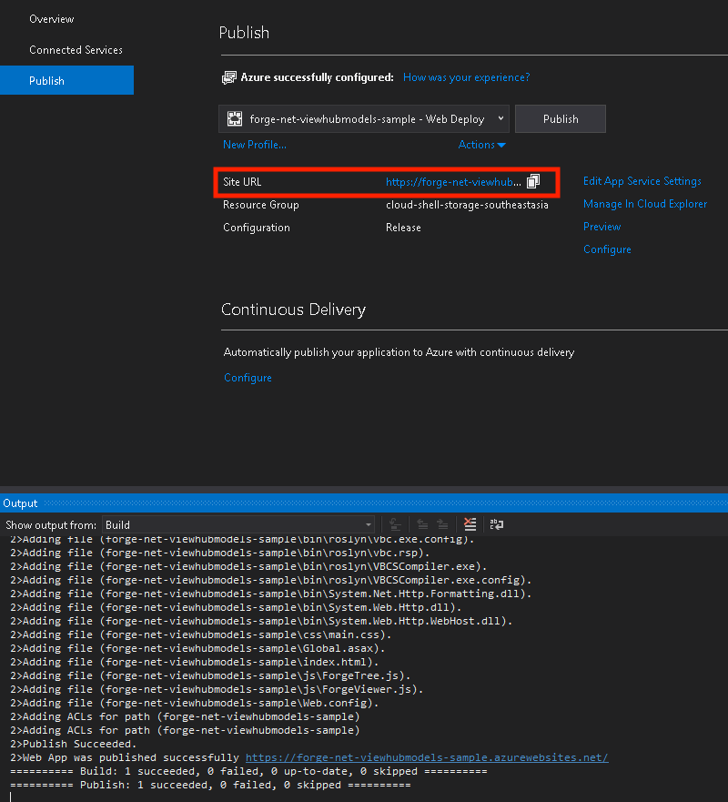
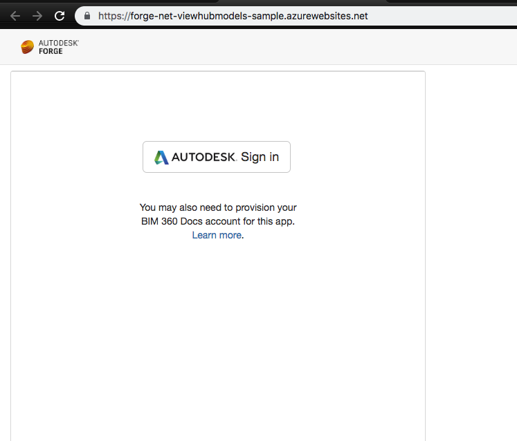
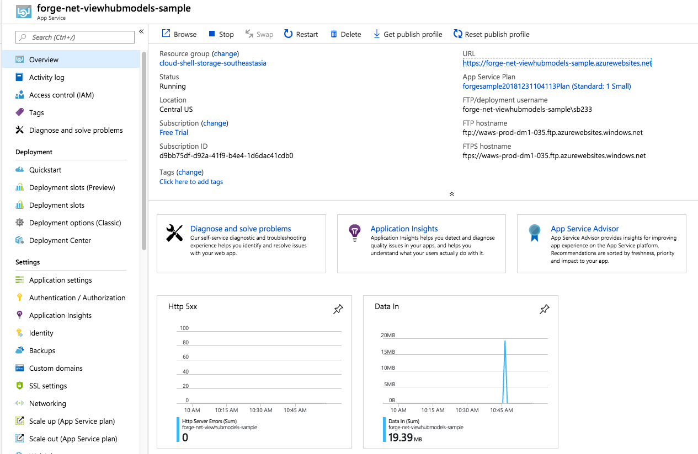

# .NET Forge App with Azure App Service

This is to walk you through the steps to deploy a sample OAuth (3-legged) Enabled .NET Forge App to Azure App Service as a API App.

For this tutorial, we will be using our ViewHubModels sample as described in [previous chapters](tutorials/viewhubmodels). You may retrieve the full sample from [our Github repo](https://github.com/Autodesk-Forge/learn.forge.viewhubmodels/tree/net/).


# Create and Deploy to Azure
- Set up the environment variables in your ```Web.config```
  ```xml
  <appSettings>
    <add key="FORGE_CLIENT_ID" value="<yourclientid>" />
    <add key="FORGE_CLIENT_SECRET" value="<yourclientsecret>" />
    <add key="FORGE_CALLBACK_URL" value="http://<nameofyourapp>.azurewebsites.net/forge/callback/oauth" />
  </appSettings>
  ```
- Right click on your project or select ```Build > Publish``` to start to publish to ```Azure App Service```

  
- Sign in or create a Azure free account

  
  
- Set the ```Name``` and ```Plan``` accordingly, note the ```Name``` will have to be globally unique and should match the name specified in your callback url previously - this is going in to the URL of your app. Click ```Create``` to start the deployment

  
- Check the build output for deployment details. And note that a new profile has been automatically created so that going forward you can deploy your solution directly to this app and won't need to go through these steps again

  
- Click on the ```Site URL``` to see the app in action

  

# Alternative Approaches

- You can create the app on the Azure Portal in your browser as well. Simply choose ```API App``` from the ```Marketplace``` when creating the App in your browser and select ```Existing App``` when publishing or creating the ```Deployment Profile``` in Visual Studio

  
- Once we have the ```API App``` created, you can deploy from a local Git repo - see [here](deployment/azure/node) for details

### Other Deployment Options
- [Visual Code](https://azure.microsoft.com/en-us/blog/visual-studio-code-and-azure-app-service-a-perfect-fit/)/[Visual Studio](../node)
- [VSTS](https://docs.microsoft.com/en-us/labs/devops/deployazurefunctionswithvsts/)
- [Github](https://blogs.msdn.microsoft.com/benjaminperkins/2017/05/10/deploy-github-source-code-repositories-to-an-azure-app-service/)
- [BitBucket](https://confluence.atlassian.com/bitbucket/deploy-to-microsoft-azure-900820699.html)
- [FTP](https://docs.microsoft.com/en-us/azure/app-service/deploy-ftp)

# Demo Screencast
Watch this screencast demonstrating deploying our Node.js sample (since we're using Git to deploy the code, the steps are very similar - simply navigate to your .NET app on the CLI when deploying, and _**remember to create a API App instead of a Web App as opposed to the screencast**_) on the Azure Portal and CLI (the screencast is based on Bash but the commands involved would have been identical on Windows CLI and Powershell. And you can run Bash on Windows! See [this](http://mingw.org/wiki/msys) or [this](https://gitforwindows.org/) as part of Git or even try the [Linux Subsystem](https://docs.microsoft.com/en-us/windows/wsl/install-win10))
<iframe width="560" height="315" src="https://www.youtube.com/embed/h_b_te0Iza0" frameborder="0" allow="accelerometer; autoplay; encrypted-media; gyroscope; picture-in-picture" allowfullscreen></iframe>

# Try For Yourself
- Adapt this sample app to the [.NET Core Framework](https://docs.microsoft.com/en-us/dotnet/core/) and deploy it as a [Azure Web App](deployment/azure/node)
- Try out [Application Insights](https://azure.microsoft.com/en-us/services/monitor/), [Cost Management](https://portal.azure.com/#blade/Microsoft_Azure_Billing/ModernBillingMenuBlade/Overview), [Security Center](https://portal.azure.com/#blade/Microsoft_Azure_Security/SecurityMenuBlade/18) and [many more Azure Cloud tools and features](https://azure.microsoft.com/en-us/services/)

# Further Readings
- What are [Resource Groups](https://docs.microsoft.com/en-us/azure/azure-resource-manager/resource-group-overview), [Service Plans](https://azure.microsoft.com/en-us/pricing/details/app-service/plans/),[Azure Templates](https://azure.microsoft.com/en-us/resources/templates/) and [Staging Environment](https://docs.microsoft.com/en-us/azure/app-service/deploy-staging-slots)?
- [Microsoft Azure Developer Camp: Build a Cloud-Native App](https://mva.microsoft.com/en-us/training-courses/microsoft-azure-developer-camp-build-a-cloud-native-app-8299)
- [Monitor Azure App Service performance](https://docs.microsoft.com/en-us/azure/application-insights/app-insights-azure-web-apps)
- [Using Azure Web Site Logging and Diagnostics](https://azure.microsoft.com/en-us/resources/videos/azure-web-site-logging-and-diagnostics/)
- [Pricing - App Service](https://azure.microsoft.com/en-us/pricing/details/app-service/windows/)
